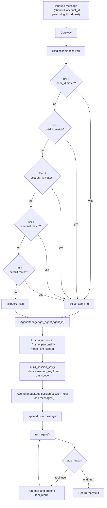

# Section 05: Gateway & Routing

> A binding table maps (channel, peer) to agent_id. Most specific wins.

## Architecture

```
    Inbound Message (channel, account_id, peer_id, text)
           |
    +------v------+     +----------+
    |   Gateway    | <-- | WS/REPL  |  JSON-RPC 2.0
    +------+------+     +----------+
           |
    +------v------+
    | BindingTable |  5-tier resolution:
    +------+------+    T1: peer_id     (most specific)
           |           T2: guild_id
           |           T3: account_id
           |           T4: channel
           |           T5: default     (least specific)
           |
     (agent_id, binding)
           |
    +------v---------+
    | build_session_key() |  dm_scope controls isolation
    +------+---------+
           |
    +------v------+
    | AgentManager |  per-agent config / personality / sessions
    +------+------+
           |
        LLM API
```

## Key Concepts

- **BindingTable**: sorted list of route bindings. Walk tiers 1-5, first match wins.
- **build_session_key()**: `dm_scope` controls isolation (per-peer, per-channel, etc.).
- **AgentManager**: multi-agent registry -- each agent has its own personality and model.
- **GatewayServer**: optional WebSocket server speaking JSON-RPC 2.0.
- **Shared event loop**: asyncio loop in a daemon thread, semaphore limits concurrency to 4.

## Key Code Walkthrough

### 1. BindingTable.resolve() -- the routing core

Bindings are sorted by `(tier, -priority)`. Resolution walks them linearly;
first match wins.

```python
@dataclass
class Binding:
    agent_id: str
    tier: int           # 1-5, lower = more specific
    match_key: str      # "peer_id" | "guild_id" | "account_id" | "channel" | "default"
    match_value: str    # e.g. "telegram:12345", "discord", "*"
    priority: int = 0   # within same tier, higher = preferred

class BindingTable:
    def resolve(self, channel="", account_id="",
                guild_id="", peer_id="") -> tuple[str | None, Binding | None]:
        for b in self._bindings:
            if b.tier == 1 and b.match_key == "peer_id":
                if ":" in b.match_value:
                    if b.match_value == f"{channel}:{peer_id}":
                        return b.agent_id, b
                elif b.match_value == peer_id:
                    return b.agent_id, b
            elif b.tier == 2 and b.match_key == "guild_id" and b.match_value == guild_id:
                return b.agent_id, b
            elif b.tier == 3 and b.match_key == "account_id" and b.match_value == account_id:
                return b.agent_id, b
            elif b.tier == 4 and b.match_key == "channel" and b.match_value == channel:
                return b.agent_id, b
            elif b.tier == 5 and b.match_key == "default":
                return b.agent_id, b
        return None, None
```

Given these demo bindings:

```python
bt.add(Binding(agent_id="luna", tier=5, match_key="default", match_value="*"))
bt.add(Binding(agent_id="sage", tier=4, match_key="channel", match_value="telegram"))
bt.add(Binding(agent_id="sage", tier=1, match_key="peer_id",
               match_value="discord:admin-001", priority=10))
```

| Input                             | Tier | Agent |
|-----------------------------------|------|-------|
| `channel=cli, peer=user1`         | 5    | Luna  |
| `channel=telegram, peer=user2`    | 4    | Sage  |
| `channel=discord, peer=admin-001` | 1    | Sage  |
| `channel=discord, peer=user3`     | 5    | Luna  |

### 2. Session key with dm_scope

Once an agent is resolved, `dm_scope` on the agent config controls session isolation:

```python
def build_session_key(agent_id, channel="", account_id="",
                      peer_id="", dm_scope="per-peer"):
    aid = normalize_agent_id(agent_id)
    if dm_scope == "per-account-channel-peer" and peer_id:
        return f"agent:{aid}:{channel}:{account_id}:direct:{peer_id}"
    if dm_scope == "per-channel-peer" and peer_id:
        return f"agent:{aid}:{channel}:direct:{peer_id}"
    if dm_scope == "per-peer" and peer_id:
        return f"agent:{aid}:direct:{peer_id}"
    return f"agent:{aid}:main"
```

| dm_scope                   | Key Format                               | Effect                              |
|----------------------------|------------------------------------------|-------------------------------------|
| `main`                     | `agent:{id}:main`                        | Everyone shares one session         |
| `per-peer`                 | `agent:{id}:direct:{peer}`               | Isolated per user                   |
| `per-channel-peer`         | `agent:{id}:{ch}:direct:{peer}`          | Different session per platform      |
| `per-account-channel-peer` | `agent:{id}:{ch}:{acc}:direct:{peer}`    | Most isolated                       |

### 3. AgentConfig -- per-agent personality

Each agent carries its own config. The system prompt is generated from it:

```python
@dataclass
class AgentConfig:
    id: str
    name: str
    personality: str = ""
    model: str = ""              # empty = use global MODEL_ID
    dm_scope: str = "per-peer"

    def system_prompt(self) -> str:
        parts = [f"You are {self.name}."]
        if self.personality:
            parts.append(f"Your personality: {self.personality}")
        parts.append("Answer questions helpfully and stay in character.")
        return " ".join(parts)
```

## Mental Model

You can compress this section into two consecutive decisions:

1. Which agent should handle this message?
2. Which session inside that agent should this message belong to?

`BindingTable` solves the first question. `build_session_key()` plus `dm_scope`
solves the second.



## Why This Design Exists

### Why can't Section 04 just send every message to one default agent?

Because Section 04 only solves "how different platforms become the same
`InboundMessage`". It does not solve "who should own this message".

If every message goes to one default agent, you get:

- cross-user context leakage
- cross-platform history mixing
- no clean separation between agent roles/personalities
- all entry logic collapsing into one agent

So Section 05 is not optional complexity. It is the minimum dispatch layer
needed once you have multiple users, multiple channels, or multiple agents.

### Are route rules hard-coded, or model-based with rules as fallback?

In this section, routing is **hard-coded**. `BindingTable.resolve()` walks the
tiers in order and returns the first match. The model is not asked to decide
routing first.

That is deliberate. Entry routing should be:

- predictable
- reproducible
- debuggable
- overrideable by config

The model belongs in agent behavior, not in the outermost dispatch layer.

### If routing is wrong, is that an entry-layer bug or an agent-capability bug?

It depends on where the mistake happened:

- wrong `agent_id`: entry/routing layer bug
- wrong `session_key`: entry/session-isolation layer bug
- correct agent and session, but bad answer: agent-capability bug

One of the main values of Section 05 is that it separates dispatch failures
from reasoning failures.

### Where is the boundary between Gateway and Channel?

Shortest version:

- `Channel` handles "how to receive and send"
- `Gateway` handles "where the received message goes"

More concretely:

- `Channel` deals with platform specifics: Telegram polling, Feishu long
  connection, CLI stdin/stdout
- `Gateway` deals with internal dispatch: route resolution, agent selection,
  session-key construction, agent execution

So:

`Channel` translates the outside world into a unified message.
`Gateway` decides where that unified message should go inside the system.

## Try It

```sh
python en/s05_gateway_routing.py

# Test routing
# You > /bindings                      (see all route bindings)
# You > /route cli user1               (resolves to Luna via default)
# You > /route telegram user2           (resolves to Sage via channel binding)

# Force a specific agent
# You > /switch sage
# You > Hello!                          (talks to Sage regardless of route)
# You > /switch off                     (restore normal routing)

# Start the WebSocket gateway
# You > /gateway
# Gateway running on ws://localhost:8765
```

## How OpenClaw Does It

| Aspect           | claw0 (this file)              | OpenClaw production                    |
|------------------|--------------------------------|----------------------------------------|
| Route resolution | 5-tier linear scan             | Same tier system + config file         |
| Session keys     | `dm_scope` parameter           | Same dm_scope with persistent sessions |
| Multi-agent      | In-memory AgentConfig          | Per-agent workspace directories        |
| Gateway          | WebSocket + JSON-RPC 2.0       | Same protocol + HTTP API               |
| Concurrency      | `asyncio.Semaphore(4)`         | Same semaphore pattern                 |
