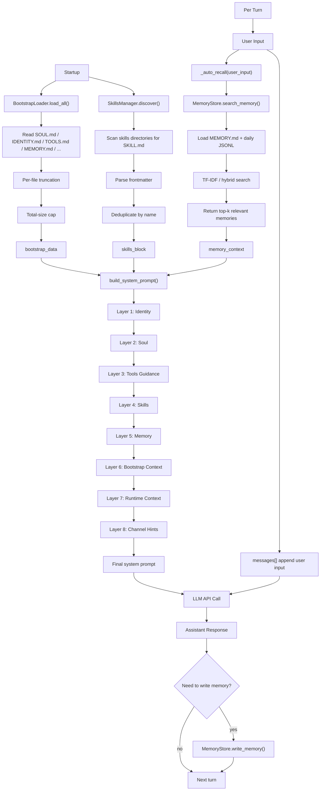

# Section 06: Intelligence

> The system prompt is assembled from files on disk. Swap files, change personality.

## Architecture

```
    Startup                              Per-Turn
    =======                              ========

    BootstrapLoader                      User Input
    load SOUL.md, IDENTITY.md, ...           |
    truncate per file (20k)                  v
    cap total (150k)                    _auto_recall(user_input)
         |                              search memory by TF-IDF
         v                                   |
    SkillsManager                            v
    scan directories for SKILL.md       build_system_prompt()
    parse frontmatter                   assemble 8 layers:
    deduplicate by name                     1. Identity
         |                                  2. Soul (personality)
         v                                  3. Tools guidance
    bootstrap_data + skills_block           4. Skills
    (cached for all turns)                  5. Memory (evergreen + recalled)
                                            6. Bootstrap (remaining files)
                                            7. Runtime context
                                            8. Channel hints
                                                |
                                                v
                                            LLM API call

    Earlier layers = stronger influence on behavior.
    SOUL.md is at layer 2 for exactly this reason.
```

## Key Concepts

- **BootstrapLoader**: loads up to 8 markdown files from workspace with per-file and total caps.
- **SkillsManager**: scans multiple directories for `SKILL.md` files with YAML frontmatter.
- **MemoryStore**: two-tier storage (evergreen MEMORY.md + daily JSONL), TF-IDF search.
- **_auto_recall()**: searches memory using the user's message, injects results into the prompt.
- **build_system_prompt()**: assembles 8 layers into a single string, rebuilt every turn.

## Mental Model

The first five sections mainly build the skeleton: loop, tools, sessions,
channels, routing. Section 06 starts answering a more central question:

`Before each model call, how is the agent's "brain" actually assembled?`

The core chain for this section can be compressed to:

`personality/rules/skills/memory on disk -> build_system_prompt() -> this turn's system prompt`



Shortest version:

`06 = static personality + dynamic memory + runtime context -> rebuild the brain every turn`

## Key Code Walkthrough

### 1. build_system_prompt() -- the 8-layer assembly

This function is the core of the intelligence system. It produces a different
system prompt every turn because memory may have been updated.

```python
def build_system_prompt(mode="full", bootstrap=None, skills_block="",
                        memory_context="", agent_id="main", channel="terminal"):
    sections: list[str] = []

    # Layer 1: Identity
    identity = bootstrap.get("IDENTITY.md", "").strip()
    sections.append(identity if identity else "You are a helpful AI assistant.")

    # Layer 2: Soul (personality) -- earlier = stronger influence
    if mode == "full":
        soul = bootstrap.get("SOUL.md", "").strip()
        if soul:
            sections.append(f"## Personality\n\n{soul}")

    # Layer 3: Tools guidance
    tools_md = bootstrap.get("TOOLS.md", "").strip()
    if tools_md:
        sections.append(f"## Tool Usage Guidelines\n\n{tools_md}")

    # Layer 4: Skills
    if mode == "full" and skills_block:
        sections.append(skills_block)

    # Layer 5: Memory (evergreen + auto-searched)
    if mode == "full":
        # ... combine MEMORY.md and recalled memories

    # Layer 6: Bootstrap context (HEARTBEAT.md, BOOTSTRAP.md, AGENTS.md, USER.md)
    # Layer 7: Runtime context (agent ID, model, channel, time)
    # Layer 8: Channel hints ("You are responding via Telegram.")

    return "\n\n".join(sections)
```

### 2. MemoryStore.search_memory() -- TF-IDF search

Pure Python, no external vector database. Loads all memory chunks, computes
TF-IDF vectors, ranks by cosine similarity.

```python
def search_memory(self, query: str, top_k: int = 5) -> list[dict]:
    chunks = self._load_all_chunks()   # MEMORY.md paragraphs + daily JSONL entries
    query_tokens = self._tokenize(query)
    chunk_tokens = [self._tokenize(c["text"]) for c in chunks]

    # Document frequency across all chunks
    df: dict[str, int] = {}
    for tokens in chunk_tokens:
        for t in set(tokens):
            df[t] = df.get(t, 0) + 1

    def tfidf(tokens):
        tf = {}
        for t in tokens:
            tf[t] = tf.get(t, 0) + 1
        return {t: c * (math.log((n + 1) / (df.get(t, 0) + 1)) + 1)
                for t, c in tf.items()}

    def cosine(a, b):
        common = set(a) & set(b)
        if not common:
            return 0.0
        dot = sum(a[k] * b[k] for k in common)
        na = math.sqrt(sum(v * v for v in a.values()))
        nb = math.sqrt(sum(v * v for v in b.values()))
        return dot / (na * nb) if na and nb else 0.0

    qvec = tfidf(query_tokens)
    scored = []
    for i, tokens in enumerate(chunk_tokens):
        score = cosine(qvec, tfidf(tokens))
        if score > 0.0:
            scored.append({"path": chunks[i]["path"], "score": score,
                           "snippet": chunks[i]["text"][:200]})
    scored.sort(key=lambda x: x["score"], reverse=True)
    return scored[:top_k]
```

### 3. Hybrid Search Pipeline -- vector + keyword + MMR

The full search pipeline chains five stages:

1. **Keyword search** (TF-IDF): same algorithm as above, returns top-10 by cosine similarity
2. **Vector search** (hash projection): simulated embeddings via hash-based random projection, returns top-10
3. **Merge**: union by chunk text prefix, weighted combination (`vector_weight=0.7, text_weight=0.3`)
4. **Temporal decay**: `score *= exp(-decay_rate * age_days)`, recent memories score higher
5. **MMR re-ranking**: `MMR = lambda * relevance - (1-lambda) * max_similarity_to_selected`, Jaccard similarity on token sets for diversity

The hash-based vector embedding teaches the PATTERN of a dual-channel search without requiring an external embedding API.

### 4. _auto_recall() -- automatic memory injection

Before each LLM call, relevant memories are searched and injected into the
system prompt. The user does not need to ask explicitly.

```python
def _auto_recall(user_message: str) -> str:
    results = memory_store.search_memory(user_message, top_k=3)
    if not results:
        return ""
    return "\n".join(f"- [{r['path']}] {r['snippet']}" for r in results)

# In the agent loop, every turn:
memory_context = _auto_recall(user_input)
system_prompt = build_system_prompt(
    mode="full", bootstrap=bootstrap_data,
    skills_block=skills_block, memory_context=memory_context,
)
```

## Why This Design Exists

### Why should `SOUL.md` appear in an earlier layer?

Because earlier prompt layers exert stronger behavioral influence. `SOUL.md`
defines personality and speaking style, so it should appear right after
Identity and before tools/skills. That makes tone and behavior more stable.

### Why not stuff all memory into the prompt permanently?

Because not every memory is relevant to the current turn. If all memory is
always present:

- tokens get wasted on irrelevant context
- important memories get diluted
- the prompt grows bloated over time

Auto-recall exists so that only memories relevant to the current user message
are injected into this turn's brain.

### Why must `build_system_prompt()` be rebuilt every turn instead of once at startup?

Because at least three categories may have changed since the last turn:

- different user input means different recalled memories
- different runtime context such as time, channel, or agent ID
- the memory store itself may already have changed

So in a real agent, the system prompt is not a static config string. It is a
dynamic per-turn assembly.

### How does this section relate to the first five?

The first five sections build the agent's "body":

- loop
- tool use
- sessions
- channels
- routing

Section 06 starts building the "brain":

- identity
- personality
- skills
- memory
- runtime awareness

So Section 06 is not just another feature. It is the first place where all the
previous structure gets filled with actual intelligence content.

## Try It

```sh
python en/s06_intelligence.py

# Create workspace files to see the full system:
# workspace/SOUL.md       -- "You are warm, curious, and encouraging."
# workspace/IDENTITY.md   -- "You are Luna, a personal AI companion."
# workspace/MEMORY.md     -- "User prefers Python over JavaScript."

# Inspect the assembled prompt
# You > /prompt

# Check what bootstrap files are loaded
# You > /bootstrap

# Search memory
# You > /search python

# Tell it something, then ask about it later
# You > My favorite color is blue.
# You > What do you know about my preferences?
# (auto-recall finds the color memory and injects it)
```

## How OpenClaw Does It

| Aspect           | claw0 (this file)            | OpenClaw production                     |
|------------------|------------------------------|-----------------------------------------|
| Prompt assembly  | 8-layer `build_system_prompt`| Same layered approach                   |
| Bootstrap files  | Load from workspace dir      | Same file set + per-agent overrides     |
| Memory search    | Hybrid pipeline (TF-IDF + vector + MMR) | Same approach + optional embedding APIs |
| Skill discovery  | Scan directories for SKILL.md| Same scan + plugin system               |
| Auto-recall      | Search on every user message | Same pattern, configurable top_k        |
