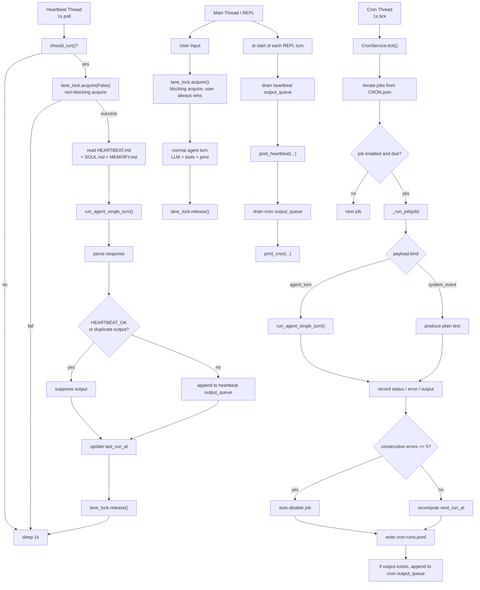

# Section 07: Heartbeat & Cron

> A timer thread checks "should I run?" and queues work alongside user messages.

## Architecture

```
    Main Lane (user input):
        User Input --> lane_lock.acquire() -------> LLM --> Print
                       (blocking: always wins)

    Heartbeat Lane (background thread, 1s poll):
        should_run()?
            |no --> sleep 1s
            |yes
        _execute():
            lane_lock.acquire(blocking=False)
                |fail --> yield (user has priority)
                |success
            build prompt from HEARTBEAT.md + SOUL.md + MEMORY.md
                |
            run_agent_single_turn()
                |
            parse: "HEARTBEAT_OK"? --> suppress
                   meaningful text? --> duplicate? --> suppress
                                           |no
                                       output_queue.append()

    Cron Service (background thread, 1s tick):
        CRON.json --> load jobs --> tick() every 1s
            |
        for each job: enabled? --> due? --> _run_job()
            |
        error? --> consecutive_errors++ --> >=5? --> auto-disable
            |ok
        consecutive_errors = 0 --> log to cron-runs.jsonl
```

## Key Concepts

- **Lane mutual exclusion**: `threading.Lock` shared between user and heartbeat. User always wins (blocking acquire); heartbeat yields (non-blocking).
- **should_run()**: 4 precondition checks before each heartbeat attempt.
- **HEARTBEAT_OK**: convention for the agent to signal "nothing to report."
- **CronService**: 3 schedule types (`at`, `every`, `cron`), auto-disable after 5 consecutive errors.
- **Output queues**: background results drain into the REPL via thread-safe lists.

## Mental Model

The point of this section is not just "add timers". It is to give the agent a
form of **controlled proactivity**:

- user messages still own the main lane
- heartbeat periodically asks "should I proactively check?"
- cron periodically executes jobs that were already scheduled



Compressed to one sentence:

`07 = let the agent act on its own, but keep user priority, suppress noise, and keep background work controllable.`

## Key Code Walkthrough

### 1. Lane mutual exclusion

The most important design principle: user messages always win.

```python
lane_lock = threading.Lock()

# Main lane: blocking acquire. User ALWAYS gets in.
lane_lock.acquire()
try:
    # handle user message, call LLM
finally:
    lane_lock.release()

# Heartbeat lane: non-blocking acquire. Yields if user is active.
def _execute(self) -> None:
    acquired = self.lane_lock.acquire(blocking=False)
    if not acquired:
        return   # user has the lock, skip this heartbeat
    self.running = True
    try:
        instructions, sys_prompt = self._build_heartbeat_prompt()
        response = run_agent_single_turn(instructions, sys_prompt)
        meaningful = self._parse_response(response)
        if meaningful and meaningful.strip() != self._last_output:
            self._last_output = meaningful.strip()
            with self._queue_lock:
                self._output_queue.append(meaningful)
    finally:
        self.running = False
        self.last_run_at = time.time()
        self.lane_lock.release()
```

### 2. should_run() -- the precondition chain

Four checks must all pass. The lock is tested separately in `_execute()`
to avoid TOCTOU races.

```python
def should_run(self) -> tuple[bool, str]:
    if not self.heartbeat_path.exists():
        return False, "HEARTBEAT.md not found"
    if not self.heartbeat_path.read_text(encoding="utf-8").strip():
        return False, "HEARTBEAT.md is empty"

    elapsed = time.time() - self.last_run_at
    if elapsed < self.interval:
        return False, f"interval not elapsed ({self.interval - elapsed:.0f}s remaining)"

    hour = datetime.now().hour
    s, e = self.active_hours
    in_hours = (s <= hour < e) if s <= e else not (e <= hour < s)
    if not in_hours:
        return False, f"outside active hours ({s}:00-{e}:00)"

    if self.running:
        return False, "already running"
    return True, "all checks passed"
```

### 3. CronService -- 3 schedule types

Jobs are defined in `CRON.json`. Each has a `schedule.kind` and a `payload`:

```python
@dataclass
class CronJob:
    id: str
    name: str
    enabled: bool
    schedule_kind: str       # "at" | "every" | "cron"
    schedule_config: dict
    payload: dict            # {"kind": "agent_turn", "message": "..."}
    consecutive_errors: int = 0

def _compute_next(self, job, now):
    if job.schedule_kind == "at":
        ts = datetime.fromisoformat(cfg.get("at", "")).timestamp()
        return ts if ts > now else 0.0
    if job.schedule_kind == "every":
        every = cfg.get("every_seconds", 3600)
        # align to anchor for predictable firing times
        steps = int((now - anchor) / every) + 1
        return anchor + steps * every
    if job.schedule_kind == "cron":
        return croniter(expr, datetime.fromtimestamp(now)).get_next(datetime).timestamp()
```

Auto-disable after 5 consecutive errors:

```python
if status == "error":
    job.consecutive_errors += 1
    if job.consecutive_errors >= 5:
        job.enabled = False
else:
    job.consecutive_errors = 0
```

## Why This Design Exists

### What is the essential difference between heartbeat and cron?

Shortest version:

- `heartbeat` = periodically decide whether proactive action is needed
- `cron` = periodically execute an action that was already scheduled

More concretely:

- `heartbeat` is more like patrol. It may legitimately do nothing, for example
  by returning `HEARTBEAT_OK`.
- `cron` is more like a calendar. When a job is due, it runs.

So heartbeat is about "is action warranted?", while cron is about "it is time
to run this job."

### Why doesn't cron reuse the full multi-turn agent loop and instead use `run_agent_single_turn()`?

Because cron is about executing a scheduled job, not sustaining a conversation.

The full loop is better for interactive dialog because it maintains history,
handles repeated tool calls, and keeps advancing one conversation. A cron job
is closer to:

- provide one task prompt
- run once
- record the result
- stop

That is more controllable, cheaper, and semantically better aligned with
scheduled task execution.

### Is heartbeat running the model every second?

No. The background thread only checks `should_run()` once per second.

Actual heartbeat execution still requires all of these to pass:

- `HEARTBEAT.md` exists
- `HEARTBEAT.md` is non-empty
- `HEARTBEAT_INTERVAL` has elapsed
- current time is within `HEARTBEAT_ACTIVE_START/END`
- no heartbeat is already running
- `lane_lock` is available, meaning the user does not own the main lane

So under the default config, the more accurate mental model is:

`poll eligibility every second, but usually execute only once every 1800 seconds.`

### What do `HEARTBEAT_INTERVAL` and `HEARTBEAT_ACTIVE_START/END` mean?

- `HEARTBEAT_INTERVAL`: minimum time between actual heartbeat executions, default 1800 seconds
- `HEARTBEAT_ACTIVE_START`: earliest hour when heartbeat may run, default 9
- `HEARTBEAT_ACTIVE_END`: ending hour for heartbeat, default 22

So the default meaning is:

- heartbeat runs at most once every 30 minutes
- heartbeat may only run between 09:00 and 22:00

### What is heartbeat actually checking?

It is not checking one hard-coded system metric from the code.

The `heartbeat` mechanism only provides "periodically trigger one check". What
it checks is defined by the instructions in `HEARTBEAT.md`.

So:

- `heartbeat` = timed patrol mechanism
- `HEARTBEAT.md` = patrol SOP / check specification

It can be used to inspect:

- unfinished follow-ups from previous dialog
- notable state changes worth reporting
- long-term memory facts that require follow-up
- any patrol task you explicitly encode in `HEARTBEAT.md`

A more precise phrasing is:

`heartbeat` is often used to inspect TODOs and follow-ups, but fundamentally it is proactive inspection, not a dedicated TODO engine.

### Is the polling loop only checking whether the main lane is occupied?

No. Checking the main lane is only one gate in the heartbeat polling process,
not the whole process.

More completely, polling is repeatedly checking:

`Do all conditions required to run one heartbeat pass right now?`

Those conditions include:

- whether `HEARTBEAT.md` exists
- whether `HEARTBEAT.md` is empty
- whether enough time has elapsed since the last run
- whether the current time is inside active hours
- whether a heartbeat is already running
- whether the main lane is currently occupied by the user

The earlier checks are mainly done by `should_run()`. Main-lane availability is
checked by `lane_lock.acquire(blocking=False)`.

So the more accurate understanding is:

`polling is not just checking the lock; it is periodically checking whether the system is eligible to run one proactive inspection.`

### What is the execution goal of heartbeat?

Its goal is not "run every scheduled task" and not "sustain a conversation".

The execution goal of heartbeat is:

`at the right time, perform one lightweight proactive inspection, and only report if there is something worth reporting.`

So it is closer to:

- checking
- follow-up
- reminding
- patrolling

If there is nothing worth surfacing, it can return `HEARTBEAT_OK`, meaning it
checked and decided not to disturb the user.

### After polling passes, what does heartbeat actually send to the model?

After all conditions pass, the system does not send raw `HEARTBEAT.md` alone.

The real flow is:

1. read instructions from `HEARTBEAT.md`
2. read `SOUL.md`
3. read `MEMORY.md`
4. add current time
5. call the model once via `run_agent_single_turn()`

So the more precise wording is:

`heartbeat uses HEARTBEAT.md as the task specification, then combines soul, memory, and current time into one single-turn inspection call.`

### What does cron do after its conditions pass?

Cron does not read `HEARTBEAT.md`. It reads job definitions from `CRON.json`.

When polling finds that a job is due, the system executes that job's `payload`:

- if `payload.kind == "agent_turn"`, it sends `payload.message` to the model via `run_agent_single_turn()`
- if `payload.kind == "system_event"`, it emits fixed text directly without calling the model

So the shortest contrast is:

- `heartbeat` reads `HEARTBEAT.md` to perform inspection
- `cron` reads `CRON.json` to run jobs

## Try It

```sh
python en/s07_heartbeat_cron.py

# Create workspace/HEARTBEAT.md with instructions:
# "Check if there are any unread reminders. Reply HEARTBEAT_OK if nothing to report."

# Check heartbeat status
# You > /heartbeat

# Force a heartbeat run
# You > /trigger

# List cron jobs (requires workspace/CRON.json)
# You > /cron

# Check lane lock status
# You > /lanes
# main_locked: False  heartbeat_running: False
```

Example `CRON.json`:

```json
{
  "jobs": [
    {
      "id": "daily-check",
      "name": "Daily Check",
      "enabled": true,
      "schedule": {"kind": "cron", "expr": "0 9 * * *"},
      "payload": {"kind": "agent_turn", "message": "Generate a daily summary."}
    }
  ]
}
```

## How OpenClaw Does It

| Aspect           | claw0 (this file)             | OpenClaw production                     |
|------------------|-------------------------------|-----------------------------------------|
| Lane exclusion   | `threading.Lock`, non-blocking| Same lock pattern                       |
| Heartbeat config | `HEARTBEAT.md` in workspace   | Same file + env var overrides           |
| Cron schedules   | `CRON.json`, 3 kinds          | Same format + webhook triggers          |
| Auto-disable     | 5 consecutive errors          | Same threshold, configurable            |
| Output delivery  | In-memory queue, drain to REPL| Delivery queue (Section 08)             |
