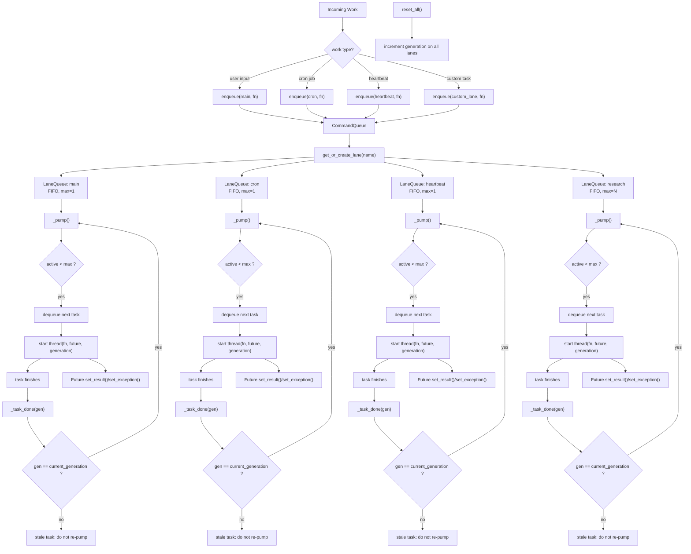

# Section 10: Concurrency

> Named lanes serialize the chaos.

## Architecture

```
    Incoming Work
        |
    CommandQueue.enqueue(lane, fn)
        |
    +---v---+    +--------+    +-----------+
    | main  |    |  cron  |    | heartbeat |
    | max=1 |    | max=1  |    |   max=1   |
    | FIFO  |    | FIFO   |    |   FIFO    |
    +---+---+    +---+----+    +-----+-----+
        |            |              |
    [active]     [active]       [active]
        |            |              |
    _task_done   _task_done     _task_done
        |            |              |
    _pump()      _pump()        _pump()
    (dequeue     (dequeue       (dequeue
     next if      next if        next if
     active<max)  active<max)    active<max)
```

Each lane is a `LaneQueue`: a FIFO deque guarded by a `threading.Condition`. Tasks enter as plain callables and return results through `concurrent.futures.Future`. The `CommandQueue` dispatches work into the correct lane by name and manages the full lifecycle.

## Mental Model

`Section 10` is not mainly about “how to use threads.” It is about this question:

`When user input, heartbeat, cron, and custom background work all exist at once, how does the system keep them from stepping on each other instead of shoving everything through one shared execution path?`

You can compress the design into two steps:

1. First decide which `lane` this unit of work belongs to
2. Then let that `lane` decide whether to run serially or concurrently, and when it is allowed to pump the next task



## Why This Design Exists

### 1. What is a `lane`

A `lane` is a named execution path.

It is not a thread, not a single task, and not a conversation `session`. It expresses:

`When this category of work enters the system, what queueing, concurrency, and lifecycle rules should it obey?`

For example:

- `main`: user-facing primary path
- `cron`: scheduled background work
- `heartbeat`: periodic background checks

So a `lane` is closer to “a lane with traffic rules” than “a car.”

### 2. How lane relates to threads, queues, and sessions

Lane vs thread:

- A `lane` is not a thread
- A `lane` starts threads to execute tasks
- A `lane` may start many threads over time
- When `max_concurrency=1`, only one thread runs at a time in that lane
- When `max_concurrency>1`, the same lane can run multiple tasks concurrently

So more precisely:

`the lane defines execution policy; the thread is only the execution vehicle.`

Lane vs queue:

- Each `lane` owns its own FIFO deque
- Tasks first enter that lane’s queue
- `_pump()` then decides when tasks may leave the queue based on `active_count < max_concurrency`

So:

`lane = queue + concurrency policy + lifecycle state`

It is not a bare queue. It is a named queue with scheduling behavior attached.

Lane vs session:

- `session` solves context ownership
- `lane` solves execution ownership

That means:

- `session` decides which history a message belongs to
- `lane` decides which execution path the resulting work should run on

These are different axes and should not be mixed together.

### 3. Why named lanes exist

Because different categories of work should not share the exact same execution order.

If you throw user input, heartbeat, cron, and custom background work into one global queue, several problems appear immediately:

- user messages can be delayed by background work
- heartbeat and cron block each other for no good reason
- you cannot tune concurrency per workload type
- once the system is busy, it becomes hard to see who is consuming capacity

So the core idea of named lanes is:

`classify first, then allow concurrency.`

For example:

- `main` preserves user-facing semantics
- `heartbeat` should stay restrained instead of behaving like arbitrary background work
- `cron` can queue on its own cadence
- a custom lane may allow `max_concurrency=3`

That is what “structured concurrency” means in this section.

### 4. What `generation tracking` is preventing

It prevents this class of bug:

`an old task finishes after a reset, then tries to keep driving the queue forward using stale state.`

The dangerous sequence is usually:

1. a lane still has in-flight work
2. the system resets and semantically enters a new lifecycle
3. the lane’s generation is incremented
4. an old task finishes
5. without protection, it calls `_pump()`
6. now an old completion callback keeps draining follow-up work

That is a classic stale / zombie scheduling problem.

So `generation` is not mainly about killing old threads. It is about:

`removing the authority of old threads to continue driving new scheduling.`

### 5. How the system decides an old task is stale

The rule is straightforward:

`compare the generation carried by the completed task with the lane’s current generation.`

The relevant code is:

```python
def _task_done(self, gen):
    with self._condition:
        self._active_count -= 1
        if gen == self._generation:
            self._pump()
        self._condition.notify_all()
```

If `gen != self._generation`, the task belongs to an old generation:

- it may finish quietly
- but its completion is no longer allowed to trigger a new `_pump()`

The important nuance is that “stale” here mainly means:

`its scheduling side effects are stale, not necessarily that the thread itself must be force-killed.`

That is the easiest point to misread in this section.

## Key Concepts

- **Named lanes**: Each lane has a name (e.g. `"main"`, `"cron"`, `"heartbeat"`) and its own independent FIFO queue. Lanes are created lazily on first use.
- **max_concurrency**: Each lane caps how many tasks run simultaneously. Default is 1 (serial execution). Increase to allow parallel work within a lane.
- **_pump() loop**: After each task completes (`_task_done`), the lane checks if more tasks can be dequeued. This self-pumping design means no external scheduler is needed.
- **Future-based results**: Every `enqueue()` returns a `concurrent.futures.Future`. Callers can block on `future.result()` or attach callbacks via `add_done_callback()`.
- **Generation tracking**: Each lane has an integer generation counter. On `reset_all()`, all generations increment. When a stale task completes (its generation does not match current), `_pump()` is not called -- preventing zombie tasks from draining the queue after a restart.
- **Condition-based synchronization**: `threading.Condition` replaces the raw `threading.Lock` from Section 07. This enables `wait_for_idle()` to sleep efficiently until notified rather than polling.
- **User priority**: User input goes into the `main` lane and blocks on the result. Background work (heartbeat, cron) goes into separate lanes and never blocks the REPL.

## Key Code Walkthrough

### 1. LaneQueue -- the core primitive

A lane is a deque + condition variable + active counter. `_pump()` is the engine:

```python
class LaneQueue:
    def __init__(self, name: str, max_concurrency: int = 1) -> None:
        self.name = name
        self.max_concurrency = max(1, max_concurrency)
        self._deque = deque()           # [(fn, future, generation), ...]
        self._condition = threading.Condition()
        self._active_count = 0
        self._generation = 0

    def enqueue(self, fn, generation=None):
        future = concurrent.futures.Future()
        with self._condition:
            gen = generation if generation is not None else self._generation
            self._deque.append((fn, future, gen))
            self._pump()
        return future

    def _pump(self):
        """Pop and start tasks while active < max_concurrency."""
        while self._active_count < self.max_concurrency and self._deque:
            fn, future, gen = self._deque.popleft()
            self._active_count += 1
            threading.Thread(
                target=self._run_task, args=(fn, future, gen), daemon=True
            ).start()

    def _task_done(self, gen):
        with self._condition:
            self._active_count -= 1
            if gen == self._generation:  # stale tasks do not re-pump
                self._pump()
            self._condition.notify_all()
```

### 2. CommandQueue -- the dispatcher

The `CommandQueue` holds a dict of lane_name to `LaneQueue`. Lanes are created lazily:

```python
class CommandQueue:
    def __init__(self):
        self._lanes: dict[str, LaneQueue] = {}
        self._lock = threading.Lock()

    def get_or_create_lane(self, name, max_concurrency=1):
        with self._lock:
            if name not in self._lanes:
                self._lanes[name] = LaneQueue(name, max_concurrency)
            return self._lanes[name]

    def enqueue(self, lane_name, fn):
        lane = self.get_or_create_lane(lane_name)
        return lane.enqueue(fn)

    def reset_all(self):
        """Increment generation on all lanes for restart recovery."""
        with self._lock:
            for lane in self._lanes.values():
                with lane._condition:
                    lane._generation += 1
```

### 3. Generation tracking -- restart recovery

The generation counter solves a subtle problem: if the system restarts while tasks are in flight, those tasks may complete and try to pump the queue with stale state. By incrementing the generation, all old callbacks become harmless no-ops:

```python
def _task_done(self, gen):
    with self._condition:
        self._active_count -= 1
        if gen == self._generation:
            self._pump()       # current generation: normal flow
        # else: stale task -- do NOT pump, let it die quietly
        self._condition.notify_all()
```

### 4. HeartbeatRunner -- lane-aware skip

Instead of `lock.acquire(blocking=False)`, the heartbeat checks the lane stats:

```python
def heartbeat_tick(self):
    ok, reason = self.should_run()
    if not ok:
        return

    lane_stats = self.command_queue.get_or_create_lane(LANE_HEARTBEAT).stats()
    if lane_stats["active"] > 0:
        return  # lane is busy, skip this tick

    future = self.command_queue.enqueue(LANE_HEARTBEAT, _do_heartbeat)
    future.add_done_callback(_on_done)
```

This is functionally equivalent to the non-blocking lock pattern but expressed in terms of the lane abstraction.

## Try It

```sh
python en/s10_concurrency.py

# Show all lanes and their current status
# You > /lanes
#   main          active=[.]  queued=0  max=1  gen=0
#   cron          active=[.]  queued=0  max=1  gen=0
#   heartbeat     active=[.]  queued=0  max=1  gen=0

# Manually enqueue work into a named lane
# You > /enqueue main What is the capital of France?

# Create a custom lane and enqueue work into it
# You > /enqueue research Summarize recent AI developments

# Change max_concurrency for a lane
# You > /concurrency research 3

# Show generation counters
# You > /generation

# Simulate a restart (increment all generations)
# You > /reset

# Show pending items per lane
# You > /queue
```

## How OpenClaw Does It

| Aspect              | claw0 (this file)                         | OpenClaw production                            |
|---------------------|-------------------------------------------|------------------------------------------------|
| Lane primitive      | `LaneQueue` with `threading.Condition`    | Same pattern, with metrics instrumentation     |
| Dispatcher          | `CommandQueue` dict of lanes              | Same lazy-creation dispatcher                  |
| Concurrency control | `max_concurrency` per lane, default 1     | Same, configurable per deployment              |
| Task execution      | `threading.Thread` per task               | Thread pool with bounded workers               |
| Result delivery     | `concurrent.futures.Future`               | Same Future-based interface                    |
| Generation tracking | Integer counter, stale tasks skip pump    | Same generation pattern for restart safety     |
| Idle detection      | `wait_for_idle()` with Condition.wait()   | Same, used for graceful shutdown               |
| Standard lanes      | main, cron, heartbeat                     | Same defaults + plugin-defined custom lanes    |
| User priority       | Main lane blocks on result                | Same blocking semantics for user input         |
