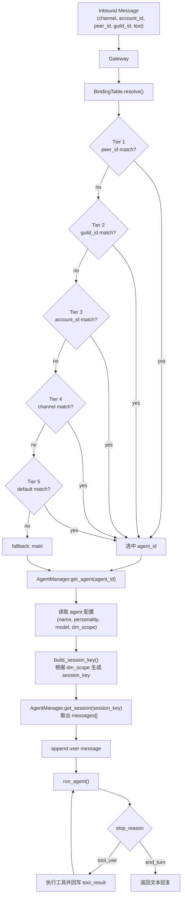

# 第 05 节: 网关与路由

> 一张绑定表将 (channel, peer) 映射到 agent_id. 最具体的匹配优先.

## 架构

```
    Inbound Message (channel, account_id, peer_id, text)
           |
    +------v------+     +----------+
    |   Gateway    | <-- | WS/REPL  |  JSON-RPC 2.0
    +------+------+     +----------+
           |
    +------v------+
    | BindingTable |  5-tier resolution:
    +------+------+    T1: peer_id     (most specific)
           |           T2: guild_id
           |           T3: account_id
           |           T4: channel
           |           T5: default     (least specific)
           |
     (agent_id, binding)
           |
    +------v---------+
    | build_session_key() |  dm_scope controls isolation
    +------+---------+
           |
    +------v------+
    | AgentManager |  per-agent config / personality / sessions
    +------+------+
           |
        LLM API
```

## 本节要点

- **BindingTable**: 排序的路由绑定列表. 从 tier 1 到 tier 5 遍历, 首次匹配即返回.
- **build_session_key()**: `dm_scope` 控制会话隔离 (每用户、每通道等).
- **AgentManager**: 多 agent 注册中心 -- 每个 agent 有自己的性格和模型.
- **GatewayServer**: 可选的 WebSocket 服务器, 使用 JSON-RPC 2.0 协议.
- **共享事件循环**: daemon 线程中的 asyncio 循环, 信号量限制并发数为 4.

## 核心代码走读

### 1. BindingTable.resolve() -- 路由核心

绑定按 `(tier, -priority)` 排序. 解析时线性遍历, 首次匹配即返回.

```python
@dataclass
class Binding:
    agent_id: str
    tier: int           # 1-5, 越小越具体
    match_key: str      # "peer_id" | "guild_id" | "account_id" | "channel" | "default"
    match_value: str    # e.g. "telegram:12345", "discord", "*"
    priority: int = 0   # 同一 tier 内, 越高越优先

class BindingTable:
    def resolve(self, channel="", account_id="",
                guild_id="", peer_id="") -> tuple[str | None, Binding | None]:
        for b in self._bindings:
            if b.tier == 1 and b.match_key == "peer_id":
                if ":" in b.match_value:
                    if b.match_value == f"{channel}:{peer_id}":
                        return b.agent_id, b
                elif b.match_value == peer_id:
                    return b.agent_id, b
            elif b.tier == 2 and b.match_key == "guild_id" and b.match_value == guild_id:
                return b.agent_id, b
            elif b.tier == 3 and b.match_key == "account_id" and b.match_value == account_id:
                return b.agent_id, b
            elif b.tier == 4 and b.match_key == "channel" and b.match_value == channel:
                return b.agent_id, b
            elif b.tier == 5 and b.match_key == "default":
                return b.agent_id, b
        return None, None
```

给定以下示例绑定:

```python
bt.add(Binding(agent_id="luna", tier=5, match_key="default", match_value="*"))
bt.add(Binding(agent_id="sage", tier=4, match_key="channel", match_value="telegram"))
bt.add(Binding(agent_id="sage", tier=1, match_key="peer_id",
               match_value="discord:admin-001", priority=10))
```

| 输入                              | Tier | Agent |
|-----------------------------------|------|-------|
| `channel=cli, peer=user1`         | 5    | Luna  |
| `channel=telegram, peer=user2`    | 4    | Sage  |
| `channel=discord, peer=admin-001` | 1    | Sage  |
| `channel=discord, peer=user3`     | 5    | Luna  |

### 2. 带 dm_scope 的会话 key

agent 解析完成后, agent 配置上的 `dm_scope` 控制会话隔离方式:

```python
def build_session_key(agent_id, channel="", account_id="",
                      peer_id="", dm_scope="per-peer"):
    aid = normalize_agent_id(agent_id)
    if dm_scope == "per-account-channel-peer" and peer_id:
        return f"agent:{aid}:{channel}:{account_id}:direct:{peer_id}"
    if dm_scope == "per-channel-peer" and peer_id:
        return f"agent:{aid}:{channel}:direct:{peer_id}"
    if dm_scope == "per-peer" and peer_id:
        return f"agent:{aid}:direct:{peer_id}"
    return f"agent:{aid}:main"
```

| dm_scope                   | Key 格式                                 | 效果                      |
|----------------------------|------------------------------------------|---------------------------|
| `main`                     | `agent:{id}:main`                        | 所有人共享一个会话        |
| `per-peer`                 | `agent:{id}:direct:{peer}`               | 每个用户隔离              |
| `per-channel-peer`         | `agent:{id}:{ch}:direct:{peer}`          | 每个平台的不同会话        |
| `per-account-channel-peer` | `agent:{id}:{ch}:{acc}:direct:{peer}`    | 最大隔离度                |

### 3. AgentConfig -- 每个 agent 的性格

每个 agent 携带自己的配置. 系统提示词从配置生成:

```python
@dataclass
class AgentConfig:
    id: str
    name: str
    personality: str = ""
    model: str = ""              # 空 = 使用全局 MODEL_ID
    dm_scope: str = "per-peer"

    def system_prompt(self) -> str:
        parts = [f"You are {self.name}."]
        if self.personality:
            parts.append(f"Your personality: {self.personality}")
        parts.append("Answer questions helpfully and stay in character.")
        return " ".join(parts)
```

## 心智模型

可以把本节记成两个连续决策:

1. 这条消息应该交给哪个 agent?
2. 这条消息应该落到这个 agent 的哪条 session?

`BindingTable` 解决第一个问题, `build_session_key()` + `dm_scope` 解决第二个问题。



## 为什么要这样设计

### 为什么第 04 节不能把所有消息都交给一个默认 agent?

因为第 04 节只解决了"不同平台消息如何统一成 `InboundMessage`", 没有解决
"这条消息该归谁处理". 如果所有消息都直接进一个默认 agent, 会出现:

- 多个用户共享错误上下文
- 多个平台之间串历史
- 不同人格/职责的 agent 无法分工
- 所有入口逻辑都堆到同一个 agent 身上

所以第 05 节新增的不是"另一层复杂度", 而是系统在多入口、多用户、多 agent
条件下必须有的分发层。

### 路由规则是硬编码规则, 还是模型判断 + 规则兜底?

在本节代码里, 路由是**硬编码规则**。`BindingTable.resolve()` 按 tier 顺序线性匹配,
首次命中即返回, 没有先让模型判断路由。

这样做的原因是入口路由需要:

- 可预测
- 可复现
- 可调试
- 可被配置覆盖

模型更适合放在后面的 agent 行为层, 而不是最外层的消息分发层。

### 如果路由错了, 错的是入口层还是 agent 能力层?

要看错发生在哪一步:

- `agent_id` 选错了: 是入口层 / 路由层的问题
- `session_key` 算错了: 是入口层 / 会话隔离层的问题
- agent 收到正确消息但回答不好: 是 agent 能力层的问题

第 05 节的重要价值之一, 就是把"分发错误"和"回答错误"拆开。

### Gateway 和 Channel 的边界在哪里?

最短定义:

- `Channel` 负责"怎么收、怎么发"
- `Gateway` 负责"收到之后交给谁处理"

更具体地说:

- `Channel` 处理平台差异: Telegram 轮询、飞书长连接、CLI 输入输出
- `Gateway` 处理系统内部分发: 解析路由、选择 agent、构建 session key、调用 agent

也就是说:

`Channel` 把外部世界翻译成统一消息, `Gateway` 决定这条统一消息在系统内部去哪里。

## 试一试

```sh
python zh/s05_gateway_routing.py

# 测试路由
# You > /bindings                      (查看所有路由绑定)
# You > /route cli user1               (通过 default 解析到 Luna)
# You > /route telegram user2           (通过 channel 绑定解析到 Sage)

# 强制指定 agent
# You > /switch sage
# You > Hello!                          (无论路由结果如何都和 Sage 对话)
# You > /switch off                     (恢复正常路由)

# 启动 WebSocket 网关
# You > /gateway
# Gateway running on ws://localhost:8765

### WebSocket 网关使用要点

- 依赖: 需要 `websockets` (服务端) 和 `httpx` 已安装.
- 启动: 在 REPL 输入 `/gateway` 后网关会在后台启动, 默认监听 `ws://localhost:8765`.
- 协议: JSON-RPC 2.0, 入口方法见代码中的 `methods` 映射 (`send`, `bindings.set`, `bindings.list`, `sessions.list`, `agents.list`, `status`).
- 基本请求示例 (wscat/任意 WebSocket 客户端均可):
    ```json
    {"jsonrpc":"2.0","id":1,"method":"send","params":{"text":"hello","channel":"websocket","peer_id":"ws-client"}}
    ```
    返回包含 `reply`、`agent_id`、`session_key` 等字段.
- Python 客户端示例:
    ```python
    import asyncio, websockets, json

    async def main():
            async with websockets.connect("ws://localhost:8765") as ws:
                    req = {"jsonrpc":"2.0","id":1,"method":"send",
                                 "params":{"text":"hello","channel":"websocket","peer_id":"ws-client"}}
                    await ws.send(json.dumps(req))
                    print(await ws.recv())

    asyncio.run(main())
    ```
```

## OpenClaw 中的对应实现

| 方面             | claw0 (本文件)                 | OpenClaw 生产代码                      |
|------------------|--------------------------------|----------------------------------------|
| 路由解析         | 5 层线性扫描                   | 相同的层级系统 + 配置文件              |
| 会话 key         | `dm_scope` 参数                | 相同的 dm_scope + 持久化会话           |
| 多 agent         | 内存中的 AgentConfig           | 每个 agent 独立的工作区目录            |
| 网关             | WebSocket + JSON-RPC 2.0       | 相同协议 + HTTP API                    |
| 并发控制         | `asyncio.Semaphore(4)`         | 相同的信号量模式                       |
