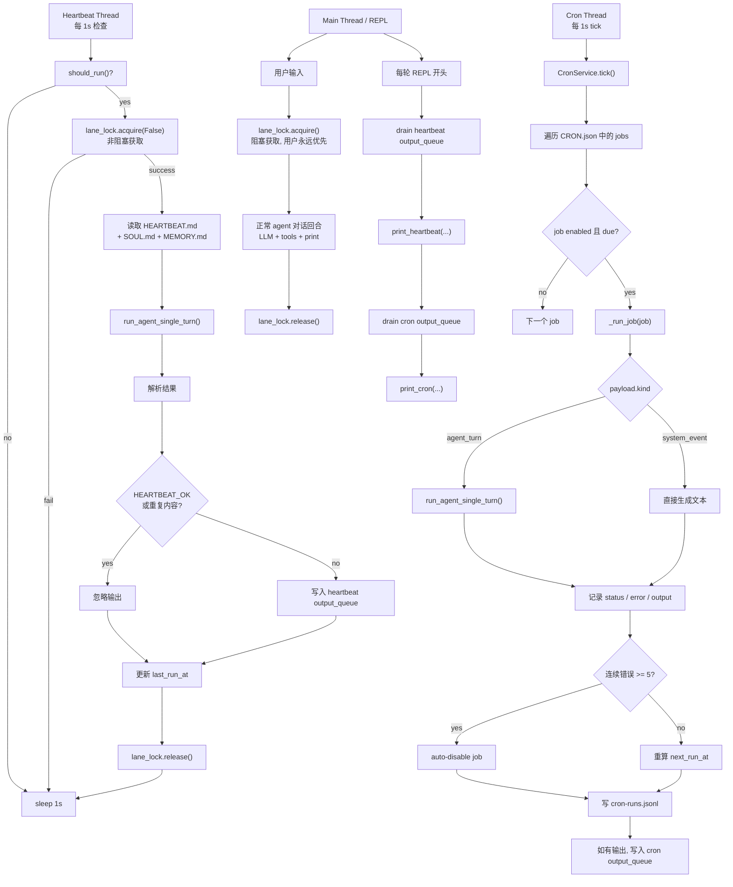

# 第 07 节: 心跳与 Cron

> 一个定时器线程检查"该不该运行", 然后将任务排入与用户消息相同的队列.

## 架构

```
    Main Lane (user input):
        User Input --> lane_lock.acquire() -------> LLM --> Print
                       (blocking: always wins)

    Heartbeat Lane (background thread, 1s poll):
        should_run()?
            |no --> sleep 1s
            |yes
        _execute():
            lane_lock.acquire(blocking=False)
                |fail --> yield (user has priority)
                |success
            build prompt from HEARTBEAT.md + SOUL.md + MEMORY.md
                |
            run_agent_single_turn()
                |
            parse: "HEARTBEAT_OK"? --> suppress
                   meaningful text? --> duplicate? --> suppress
                                           |no
                                       output_queue.append()

    Cron Service (background thread, 1s tick):
        CRON.json --> load jobs --> tick() every 1s
            |
        for each job: enabled? --> due? --> _run_job()
            |
        error? --> consecutive_errors++ --> >=5? --> auto-disable
            |ok
        consecutive_errors = 0 --> log to cron-runs.jsonl
```

## 本节要点

- **Lane 互斥**: `threading.Lock` 在用户和心跳之间共享. 用户总是赢 (阻塞获取); 心跳让步 (非阻塞获取).
- **should_run()**: 每次心跳尝试前的 4 个前置条件检查.
- **HEARTBEAT_OK**: agent 用来表示"没有需要报告的内容"的约定.
- **CronService**: 3 种调度类型 (`at`, `every`, `cron`), 连续错误 5 次后自动禁用.
- **输出队列**: 后台结果通过线程安全的列表输送到 REPL.

## 心智模型

这一节的本质不是"加了定时器", 而是给 agent 增加一种**受控的主动性**:

- 用户消息仍然是主通道
- heartbeat 定期判断"要不要主动检查"
- cron 定期执行"已经安排好的任务"



可以把本节压成一句话:

`07 = 让 agent 自己动起来, 但必须保证用户优先、输出克制、任务可控。`

## 核心代码走读

### 1. Lane 互斥

最重要的设计原则: 用户消息始终优先.

```python
lane_lock = threading.Lock()

# Main lane: 阻塞获取. 用户始终能进入.
lane_lock.acquire()
try:
    # 处理用户消息, 调用 LLM
finally:
    lane_lock.release()

# Heartbeat lane: 非阻塞获取. 用户活跃时让步.
def _execute(self) -> None:
    acquired = self.lane_lock.acquire(blocking=False)
    if not acquired:
        return   # 用户持有锁, 跳过本次心跳
    self.running = True
    try:
        instructions, sys_prompt = self._build_heartbeat_prompt()
        response = run_agent_single_turn(instructions, sys_prompt)
        meaningful = self._parse_response(response)
        if meaningful and meaningful.strip() != self._last_output:
            self._last_output = meaningful.strip()
            with self._queue_lock:
                self._output_queue.append(meaningful)
    finally:
        self.running = False
        self.last_run_at = time.time()
        self.lane_lock.release()
```

### 2. should_run() -- 前置条件链

四个检查必须全部通过. 锁的检测在 `_execute()` 中单独进行,
以避免 TOCTOU 竞态条件.

```python
def should_run(self) -> tuple[bool, str]:
    if not self.heartbeat_path.exists():
        return False, "HEARTBEAT.md not found"
    if not self.heartbeat_path.read_text(encoding="utf-8").strip():
        return False, "HEARTBEAT.md is empty"

    elapsed = time.time() - self.last_run_at
    if elapsed < self.interval:
        return False, f"interval not elapsed ({self.interval - elapsed:.0f}s remaining)"

    hour = datetime.now().hour
    s, e = self.active_hours
    in_hours = (s <= hour < e) if s <= e else not (e <= hour < s)
    if not in_hours:
        return False, f"outside active hours ({s}:00-{e}:00)"

    if self.running:
        return False, "already running"
    return True, "all checks passed"
```

### 3. CronService -- 3 种调度类型

任务定义在 `CRON.json` 中. 每个任务有一个 `schedule.kind` 和一个 `payload`:

```python
@dataclass
class CronJob:
    id: str
    name: str
    enabled: bool
    schedule_kind: str       # "at" | "every" | "cron"
    schedule_config: dict
    payload: dict            # {"kind": "agent_turn", "message": "..."}
    consecutive_errors: int = 0

def _compute_next(self, job, now):
    if job.schedule_kind == "at":
        ts = datetime.fromisoformat(cfg.get("at", "")).timestamp()
        return ts if ts > now else 0.0
    if job.schedule_kind == "every":
        every = cfg.get("every_seconds", 3600)
        # 对齐到锚点, 保证触发时间可预测
        steps = int((now - anchor) / every) + 1
        return anchor + steps * every
    if job.schedule_kind == "cron":
        return croniter(expr, datetime.fromtimestamp(now)).get_next(datetime).timestamp()
```

连续 5 次错误后自动禁用:

```python
if status == "error":
    job.consecutive_errors += 1
    if job.consecutive_errors >= 5:
        job.enabled = False
else:
    job.consecutive_errors = 0
```

## 为什么要这样设计

### heartbeat 和 cron 的本质区别是什么?

最短版本:

- `heartbeat` = 定期判断"要不要主动行动"
- `cron` = 定期执行"已经安排好的行动"

更具体地说:

- `heartbeat` 更像巡逻. 它可以什么都不做, 比如返回 `HEARTBEAT_OK`.
- `cron` 更像日程表. 到点就执行已经定义好的 job.

所以 heartbeat 的重点是"检查是否值得行动", cron 的重点是"按时间表执行任务"。

### 为什么 cron 不直接复用完整多轮 agent loop, 而用 `run_agent_single_turn()`?

因为 cron 的目标是执行一次定时任务, 不是持续对话。

完整多轮 loop 更适合用户对话场景, 因为它会维护消息历史、处理多轮工具调用、
围绕一个会话持续推进。cron job 更像:

- 给一个任务提示
- 跑一次
- 记录结果
- 结束

这样更可控、更便宜, 也更符合定时任务的语义。

### heartbeat 每秒都在执行模型吗?

不是。后台线程每 1 秒只是在检查一次 `should_run()`。

真正执行 heartbeat 还必须同时满足:

- `HEARTBEAT.md` 存在
- `HEARTBEAT.md` 非空
- 距离上次运行已经超过 `HEARTBEAT_INTERVAL`
- 当前时间在 `HEARTBEAT_ACTIVE_START/END` 范围内
- 当前没有其他 heartbeat 正在执行
- `lane_lock` 可用, 也就是用户没有占着主通道

所以默认配置下更准确的理解是:

`每秒轮询一次资格, 但通常每 1800 秒才真正执行一次 heartbeat。`

### `HEARTBEAT_INTERVAL` 和 `HEARTBEAT_ACTIVE_START/END` 是什么意思?

- `HEARTBEAT_INTERVAL`: 两次 heartbeat 真正执行之间的最小间隔, 默认 1800 秒
- `HEARTBEAT_ACTIVE_START`: 允许开始运行的小时, 默认 9
- `HEARTBEAT_ACTIVE_END`: 允许运行结束的小时, 默认 22

所以默认含义是:

- heartbeat 最多每 30 分钟执行一次
- 只允许在 09:00 到 22:00 之间执行

### heartbeat 到底在检查什么?

它不是写死在代码里的某个固定系统指标。

`heartbeat` 机制只负责"定期触发一次检查"。至于检查什么, 取决于
`HEARTBEAT.md` 里写了什么指令。

所以:

- `heartbeat` = 定时巡逻机制
- `HEARTBEAT.md` = 巡逻 SOP / 检查规则

它可以被用来检查:

- 之前对话里尚未完成的事项
- 值得提醒的状态变化
- 长期记忆中需要跟进的事实
- 其他你明确写进 `HEARTBEAT.md` 的巡检任务

更准确的说法是:

`heartbeat` 经常被用来检查待办和跟进事项, 但本质上它是在做"主动巡检", 不是专门的 todo 引擎。

### 轮询过程是不是只在检查 main lane 是否被占用?

不是。检查 main lane 只是整个 heartbeat 轮询流程中的一个门槛, 不是全部。

更完整地说, 轮询是在反复检查:

`现在是否满足执行一次 heartbeat 的全部条件?`

这些条件包括:

- `HEARTBEAT.md` 是否存在
- `HEARTBEAT.md` 是否为空
- 距离上次运行是否已经足够久
- 当前时间是否在 active hours 内
- 当前是否已经有 heartbeat 正在运行
- main lane 当前是否被用户占用

其中前几项主要由 `should_run()` 检查, main lane 是否空闲则由
`lane_lock.acquire(blocking=False)` 检查。

所以更准确的理解是:

`轮询不是只看锁, 而是在周期性检查"现在有没有资格跑一次主动巡检"。`

### heartbeat 的执行目标是什么?

它的目标不是"定时执行所有任务", 也不是"持续对话"。

heartbeat 的执行目标是:

`在合适的时候, 主动做一次轻量巡检, 并且只在真的有价值时再汇报。`

所以它更像:

- 检查
- 跟进
- 提醒
- 巡逻

如果没有值得说的内容, 它可以返回 `HEARTBEAT_OK`, 表示检查过了但无需打扰用户。

### 轮询通过之后, heartbeat 实际把什么交给模型?

轮询通过所有条件后, 系统不会只把 `HEARTBEAT.md` 裸发给模型。

实际流程是:

1. 读取 `HEARTBEAT.md` 中的指令
2. 读取 `SOUL.md`
3. 读取 `MEMORY.md`
4. 加入当前时间
5. 通过 `run_agent_single_turn()` 发起一次单轮模型调用

所以更准确的说法是:

`heartbeat 读取 HEARTBEAT.md 作为任务说明, 再结合 soul、memory 和当前时间, 组装成一次单轮巡检调用。`

### cron 在通过条件后又做了什么?

cron 不读取 `HEARTBEAT.md`, 而是读取 `CRON.json` 里的 job 定义。

当轮询发现某个 job 已到期后, 系统会取出该 job 的 `payload` 执行:

- 如果 `payload.kind == "agent_turn"`, 就把 `payload.message` 交给模型跑一次 `run_agent_single_turn()`
- 如果 `payload.kind == "system_event"`, 就直接输出固定文本, 不调用模型

所以最短对比是:

- `heartbeat` 读 `HEARTBEAT.md` 做巡检
- `cron` 读 `CRON.json` 跑 job

## 试一试

```sh
python zh/s07_heartbeat_cron.py

# 创建 workspace/HEARTBEAT.md 写入指令:
# "Check if there are any unread reminders. Reply HEARTBEAT_OK if nothing to report."

# 检查心跳状态
# You > /heartbeat

# 手动触发心跳
# You > /trigger

# 列出 cron 任务 (需要 workspace/CRON.json)
# You > /cron

# 检查 lane 锁状态
# You > /lanes
# main_locked: False  heartbeat_running: False
```

`CRON.json` 示例:

```json
{
  "jobs": [
    {
      "id": "daily-check",
      "name": "Daily Check",
      "enabled": true,
      "schedule": {"kind": "cron", "expr": "0 9 * * *"},
      "payload": {"kind": "agent_turn", "message": "Generate a daily summary."}
    }
  ]
}
```

## OpenClaw 中的对应实现

| 方面             | claw0 (本文件)                 | OpenClaw 生产代码                       |
|------------------|-------------------------------|-----------------------------------------|
| Lane 互斥       | `threading.Lock`, 非阻塞      | 相同的锁模式                            |
| 心跳配置         | 工作区中的 `HEARTBEAT.md`      | 相同文件 + 环境变量覆盖                 |
| Cron 调度        | `CRON.json`, 3 种类型         | 相同格式 + webhook 触发器               |
| 自动禁用         | 连续 5 次错误                  | 相同阈值, 可配置                        |
| 输出投递         | 内存队列, 排出到 REPL          | 投递队列 (第 08 节)                     |
