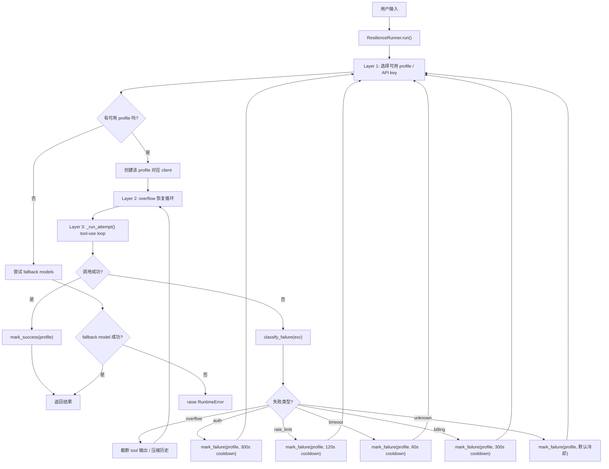
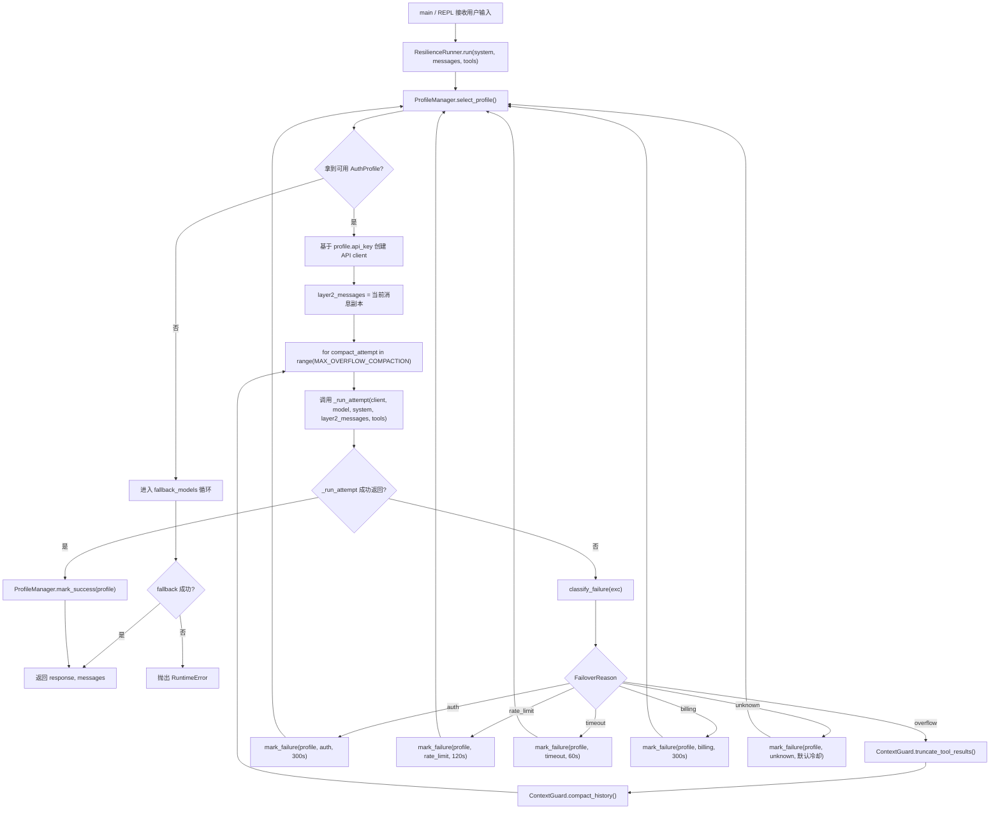
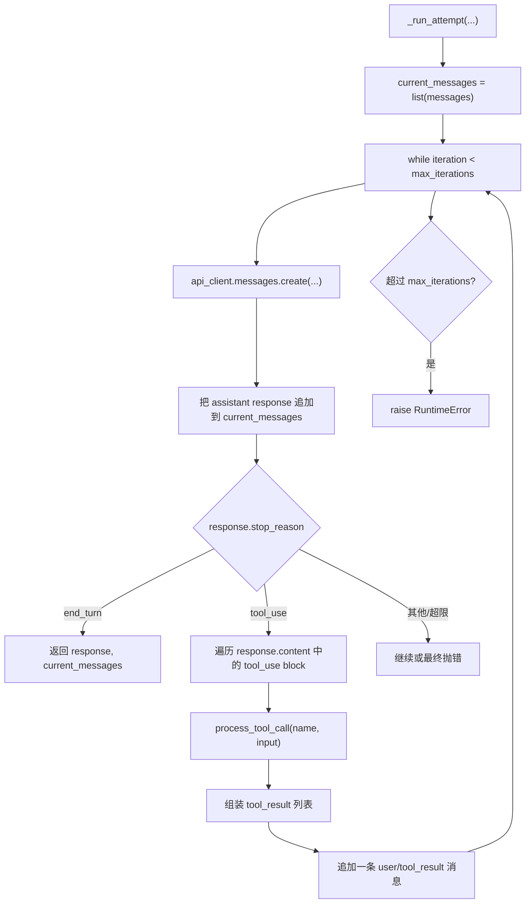

# 第 09 节: 弹性

> 一次调用失败, 轮换重试.

## 架构

```
    Profiles: [main-key, backup-key, emergency-key]
         |
    for each non-cooldown profile:          LAYER 1: Auth Rotation
         |
    create client(profile.api_key)
         |
    for compact_attempt in 0..2:            LAYER 2: Overflow Recovery
         |
    _run_attempt(client, model, ...)        LAYER 3: Tool-Use Loop
         |              |
       success       exception
         |              |
    mark_success    classify_failure()
    return result       |
                   overflow? --> compact, retry Layer 2
                   auth/rate? -> mark_failure, break to Layer 1
                   timeout?  --> mark_failure(60s), break to Layer 1
                        |
                   all profiles exhausted?
                        |
                   try fallback models
                        |
                   all fallbacks failed?
                        |
                   raise RuntimeError
```

## 本节要点

- **FailoverReason**: 枚举, 将每个异常分类为六个类别之一 (rate_limit, auth, timeout, billing, overflow, unknown). 类别决定由哪一层重试处理.
- **AuthProfile**: 数据类, 持有一个 API key 及其冷却状态. 跟踪 `cooldown_until`、`failure_reason` 和 `last_good_at`.
- **ProfileManager**: 选择第一个未冷却的配置, 标记失败 (设置冷却), 标记成功 (清除失败状态).
- **ContextGuard**: 轻量级上下文溢出保护. 截断过大的工具结果, 如果仍然溢出则通过 LLM 摘要压缩历史.
- **ResilienceRunner**: 三层重试洋葱. Layer 1 轮换配置, Layer 2 处理溢出压缩, Layer 3 是标准的工具调用循环.
- **重试限制**: `BASE_RETRY=24`, `PER_PROFILE=8`, 上限为 `min(max(base + per_profile * N, 32), 160)`.
- **SimulatedFailure**: 为下次 API 调用装备一个模拟错误, 让你无需真实故障即可观察各类失败的处理过程.

## 先记一句话

这一节是在给 agent 加上"失败后别直接死掉"的能力. 一次调用失败后, 系统不会立刻退出, 而是先判断失败类型, 再决定是换 key、压缩上下文, 还是换备选模型继续执行.

可以把整章压缩成这个公式:

```text
run() = profile 轮换 + overflow 恢复 + tool-use loop
```

其中:
- `ProfileManager` 负责"谁能上场"
- `classify_failure()` 负责"失败属于哪一类"
- `ContextGuard` 负责"上下文太长怎么缩"
- `_run_attempt()` 负责"真正把模型和工具跑起来"

## 阅读顺序建议

如果你第一次看这一节, 建议按下面顺序读:

1. 先看 `classify_failure()`, 理解错误如何分流.
2. 再看 `ProfileManager`, 理解 key 冷却和轮换.
3. 最后看 `ResilienceRunner.run()`, 理解三层重试如何串起来.

这样进入 `run()` 时, 你已经知道:
- 失败会被分成什么类别
- 某个 profile 失败后会被如何处理
- 为什么有些错误是"压缩后重试", 有些错误是"换 key"

## 主流程图

下面这张图对应整个 `ResilienceRunner.run()` 的主线:



把这张图记成三句话就够了:

1. 先换 `profile`
2. 再压 `context`
3. 最后继续跑 `tool loop`

## 代码结构图

下面这张图更贴近代码组织, 适合对照 `s09_resilience.py` 阅读:



## _run_attempt() 内部流程图

最内层 `_run_attempt()` 负责真正的 tool-use loop, 它本身不处理 profile 轮换或上下文压缩, 只负责持续调用模型直到结束或抛错:



## 核心代码走读

### 1. classify_failure() -- 将异常路由到正确的层

每个异常在重试洋葱决定处理方式之前都会经过分类. 分类器检查错误字符串中的已知模式:

```python
class FailoverReason(Enum):
    rate_limit = "rate_limit"
    auth = "auth"
    timeout = "timeout"
    billing = "billing"
    overflow = "overflow"
    unknown = "unknown"

def classify_failure(exc: Exception) -> FailoverReason:
    msg = str(exc).lower()
    if "rate" in msg or "429" in msg:
        return FailoverReason.rate_limit
    if "auth" in msg or "401" in msg or "key" in msg:
        return FailoverReason.auth
    if "timeout" in msg or "timed out" in msg:
        return FailoverReason.timeout
    if "billing" in msg or "quota" in msg or "402" in msg:
        return FailoverReason.billing
    if "context" in msg or "token" in msg or "overflow" in msg:
        return FailoverReason.overflow
    return FailoverReason.unknown
```

分类驱动不同的冷却时长:
- `auth` / `billing`: 300s (坏 key, 不会很快自愈)
- `rate_limit`: 120s (等待速率限制窗口重置)
- `timeout`: 60s (瞬态故障, 短冷却)
- `overflow`: 不冷却配置 -- 改为压缩消息

### 2. ProfileManager -- 冷却感知的 key 轮换

按顺序检查配置. 当冷却过期时配置可用. 失败后配置进入冷却; 成功后清除失败状态.

```python
class ProfileManager:
    def select_profile(self) -> AuthProfile | None:
        now = time.time()
        for profile in self.profiles:
            if now >= profile.cooldown_until:
                return profile
        return None

    def mark_failure(self, profile, reason, cooldown_seconds=300.0):
        profile.cooldown_until = time.time() + cooldown_seconds
        profile.failure_reason = reason.value

    def mark_success(self, profile):
        profile.failure_reason = None
        profile.last_good_at = time.time()
```

### 3. ResilienceRunner.run() -- 三层洋葱

外层循环遍历配置 (Layer 1). 中间循环在压缩后重试溢出 (Layer 2). 内层调用运行工具调用循环 (Layer 3).

```python
def run(self, system, messages, tools):
    # LAYER 1: Auth Rotation
    for _rotation in range(len(self.profile_manager.profiles)):
        profile = self.profile_manager.select_profile()
        if profile is None:
            break

        api_client = Anthropic(api_key=profile.api_key)

        # LAYER 2: Overflow Recovery
        layer2_messages = list(messages)
        for compact_attempt in range(MAX_OVERFLOW_COMPACTION):
            try:
                # LAYER 3: Tool-Use Loop
                result, layer2_messages = self._run_attempt(
                    api_client, self.model_id, system,
                    layer2_messages, tools,
                )
                self.profile_manager.mark_success(profile)
                return result, layer2_messages

            except Exception as exc:
                reason = classify_failure(exc)

                if reason == FailoverReason.overflow:
                    # Compact and retry Layer 2
                    layer2_messages = self.guard.truncate_tool_results(layer2_messages)
                    layer2_messages = self.guard.compact_history(
                        layer2_messages, api_client, self.model_id)
                    continue

                elif reason in (FailoverReason.auth, FailoverReason.rate_limit):
                    self.profile_manager.mark_failure(profile, reason)
                    break  # try next profile (Layer 1)

                elif reason == FailoverReason.timeout:
                    self.profile_manager.mark_failure(profile, reason, 60)
                    break  # try next profile (Layer 1)

    # All profiles exhausted -- try fallback models
    for fallback_model in self.fallback_models:
        # ... try with first available profile ...

    raise RuntimeError("all profiles and fallbacks exhausted")
```

### 4. _run_attempt() -- Layer 3 工具调用循环

最内层与第 01/02 节相同的 `while True` + `stop_reason` 分发. 在循环中运行工具调用, 直到模型返回 `end_turn` 或异常传播到外层.

```python
def _run_attempt(self, api_client, model, system, messages, tools):
    current_messages = list(messages)
    iteration = 0

    while iteration < self.max_iterations:
        iteration += 1
        response = api_client.messages.create(
            model=model, max_tokens=8096,
            system=system, tools=tools,
            messages=current_messages,
        )
        current_messages.append({"role": "assistant", "content": response.content})

        if response.stop_reason == "end_turn":
            return response, current_messages

        elif response.stop_reason == "tool_use":
            tool_results = []
            for block in response.content:
                if block.type != "tool_use":
                    continue
                result = process_tool_call(block.name, block.input)
                tool_results.append({
                    "type": "tool_result",
                    "tool_use_id": block.id,
                    "content": result,
                })
            current_messages.append({"role": "user", "content": tool_results})
            continue

    raise RuntimeError("Tool-use loop exceeded max iterations")
```

## 试一试

```sh
python zh/s09_resilience.py

# 正常对话 -- 观察单配置成功
# You > Hello!

# 查看配置状态
# You > /profiles

# 模拟速率限制失败 -- 观察配置轮换
# You > /simulate-failure rate_limit
# You > Tell me a joke

# 模拟认证失败
# You > /simulate-failure auth
# You > What time is it?

# 失败后检查冷却状态
# You > /cooldowns

# 查看备选模型链
# You > /fallback

# 查看弹性统计
# You > /stats
```

## OpenClaw 中的对应实现

| 方面             | claw0 (本文件)                          | OpenClaw 生产代码                          |
|------------------|------------------------------------------|----------------------------------------------|
| 配置轮换         | 3 个演示配置, 相同 key                  | 跨提供商的多个真实 key                       |
| 失败分类器       | 异常文本字符串匹配                       | 相同模式, 加 HTTP 状态码检查                 |
| 溢出恢复         | 截断工具结果 + LLM 摘要                  | 相同的两阶段压缩                             |
| 冷却追踪         | 内存中的浮点时间戳                       | 相同的每配置内存追踪                         |
| 备选模型         | 可配置的备选链                           | 相同链, 通常为更小/更便宜的模型              |
| 重试限制         | BASE_RETRY=24, PER_PROFILE=8, 上限=160  | 相同公式                                     |
| 模拟失败         | /simulate-failure 命令用于测试           | 集成测试工具带故障注入                       |
