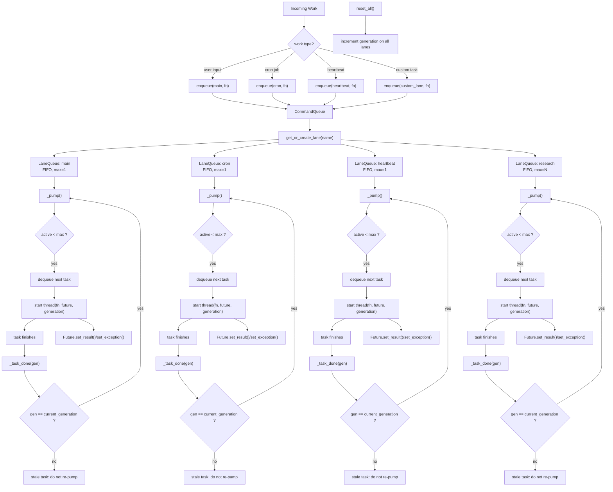

# 第 10 节: 并发

> 命名 lane 序列化混沌.

## 架构

```
    Incoming Work
        |
    CommandQueue.enqueue(lane, fn)
        |
    +---v---+    +--------+    +-----------+
    | main  |    |  cron  |    | heartbeat |
    | max=1 |    | max=1  |    |   max=1   |
    | FIFO  |    | FIFO   |    |   FIFO    |
    +---+---+    +---+----+    +-----+-----+
        |            |              |
    [active]     [active]       [active]
        |            |              |
    _task_done   _task_done     _task_done
        |            |              |
    _pump()      _pump()        _pump()
    (dequeue     (dequeue       (dequeue
     next if      next if        next if
     active<max)  active<max)    active<max)
```

每个 lane 是一个 `LaneQueue`: 由 `threading.Condition` 保护的 FIFO deque. 任务以普通 callable 进入, 通过 `concurrent.futures.Future` 返回结果. `CommandQueue` 按名称将工作分发到正确的 lane, 并管理完整的生命周期.

## 心智模型

`第 10 节` 真正要解决的不是“怎么开线程”，而是：

`当用户输入、heartbeat、cron、自定义后台任务同时存在时，系统怎么让它们各走各的执行秩序，而不是全都挤在同一条通道里互相干扰。`

可以先把它压成两步：

1. 先决定这份工作属于哪条 `lane`
2. 再由这条 `lane` 自己决定串行还是并行、何时继续泵送下一批任务



## 为什么要这样设计

### 1. 什么是 `lane`

`lane` 是一条有名字的执行通道。

它不是线程本身，也不是某个具体任务，更不是对话 `session`。它表达的是：

`一类工作进入系统后，应该遵守什么样的排队、并发和生命周期规则。`

比如：

- `main`：用户主通道
- `cron`：后台定时任务
- `heartbeat`：后台巡检任务

所以 `lane` 更像“有规则的车道”，而不是“车”本身。

### 2. lane 和线程、队列、session 的关系分别是什么

`lane` 和线程的关系：

- `lane` 不是线程
- `lane` 会启动线程执行任务
- 一个 `lane` 可以在不同时间启动多个线程
- 当 `max_concurrency=1` 时，同一时刻最多只跑一个线程
- 当 `max_concurrency>1` 时，同一 `lane` 可以并发执行多个任务

所以更准确地说：

`lane` 定义执行秩序，线程只是具体执行载体。

`lane` 和队列的关系：

- 每条 `lane` 内部都有自己的 FIFO deque
- 任务先进入这条 `lane` 的队列
- 再由 `_pump()` 按 `active_count < max_concurrency` 的条件决定何时出队

所以：

`lane = 队列 + 并发控制 + 生命周期状态`

它不是一个裸 `queue`，而是“带调度逻辑的命名队列”。

`lane` 和 `session` 的关系：

- `session` 解决的是“上下文归属”
- `lane` 解决的是“执行归属”

也就是：

- `session` 决定这条消息属于哪段历史
- `lane` 决定这条工作在哪条执行通道上跑

这是两个完全不同的维度，不能混为一谈。

### 3. 为什么要区分 named lanes

因为不同类型的工作，不应该共享同一套执行秩序。

如果把用户输入、heartbeat、cron、自定义后台任务全都塞进一个总队列，会立刻出现几个问题：

- 用户消息可能被后台任务拖慢
- heartbeat 和 cron 会互相阻塞
- 很难单独调节某类任务的并发度
- 系统忙起来时，很难看清到底是谁在占用资源

所以 `named lanes` 的本质是：

`先分类，再并发。`

例如：

- `main` 要保证用户主通道语义
- `heartbeat` 要克制，不能像普通后台任务一样乱抢执行机会
- `cron` 可以按自己的节奏排队
- 某些自定义 lane 甚至可以允许 `max_concurrency=3`

这才是“结构化并发”。

### 4. `generation tracking` 是在防什么错误

它防的是这样一种问题：

`旧任务在系统 reset 之后完成了，却还想用旧状态继续推动队列。`

危险场景通常是：

1. 某条 lane 里有任务还在执行
2. 系统发生 reset，语义上已经进入“新一轮生命周期”
3. lane 的 generation 被递增
4. 旧任务这时完成
5. 如果没有防护，它会调用 `_pump()`
6. 于是旧世界里的完成回调，继续把后续任务往下排

这就会产生典型的 stale / zombie scheduling 问题。

所以 `generation` 的意义不是“取消旧线程”，而是：

`让旧线程失去继续驱动新调度的权力。`

### 5. 系统如何判断某个旧任务已经过期

判断依据很直接：

`任务完成时携带的 generation，是否仍然等于当前 lane 的 generation。`

对应代码就是：

```python
def _task_done(self, gen):
    with self._condition:
        self._active_count -= 1
        if gen == self._generation:
            self._pump()
        self._condition.notify_all()
```

如果 `gen != self._generation`，说明这个任务属于旧 generation：

- 它可以安静结束
- 但它的完成不再有资格触发新的 `_pump()`

这里的“过期”主要是指：

`它的调度副作用已经过期，而不是说线程本身必须被强行杀掉。`

这是本节最容易看错的地方。

## 本节要点

- **命名 lane**: 每个 lane 有一个名称 (如 `"main"`, `"cron"`, `"heartbeat"`) 和独立的 FIFO 队列. Lane 在首次使用时惰性创建.
- **max_concurrency**: 每个 lane 限制同时运行的任务数. 默认为 1 (串行执行). 增加以允许 lane 内的并行工作.
- **_pump() 循环**: 每个任务完成后 (`_task_done`), lane 检查是否可以出队更多任务. 这种自泵送设计意味着不需要外部调度器.
- **基于 Future 的结果**: 每次 `enqueue()` 返回一个 `concurrent.futures.Future`. 调用方可以通过 `future.result()` 阻塞等待, 或通过 `add_done_callback()` 附加回调.
- **Generation 追踪**: 每个 lane 有一个整数 generation 计数器. `reset_all()` 时所有 generation 递增. 当过期任务完成时 (其 generation 与当前不匹配), 不调用 `_pump()` -- 防止僵尸任务在重启后排空队列.
- **基于 Condition 的同步**: `threading.Condition` 替代了第 07 节的原始 `threading.Lock`. 这使 `wait_for_idle()` 能高效地睡眠等待通知, 而非轮询.
- **用户优先**: 用户输入进入 `main` lane 并阻塞等待结果. 后台工作 (心跳、cron) 进入独立的 lane, 永远不阻塞 REPL.

## 核心代码走读

### 1. LaneQueue -- 核心原语

一个 lane 就是 deque + 条件变量 + 活跃计数器. `_pump()` 是引擎:

```python
class LaneQueue:
    def __init__(self, name: str, max_concurrency: int = 1) -> None:
        self.name = name
        self.max_concurrency = max(1, max_concurrency)
        self._deque = deque()           # [(fn, future, generation), ...]
        self._condition = threading.Condition()
        self._active_count = 0
        self._generation = 0

    def enqueue(self, fn, generation=None):
        future = concurrent.futures.Future()
        with self._condition:
            gen = generation if generation is not None else self._generation
            self._deque.append((fn, future, gen))
            self._pump()
        return future

    def _pump(self):
        """Pop and start tasks while active < max_concurrency."""
        while self._active_count < self.max_concurrency and self._deque:
            fn, future, gen = self._deque.popleft()
            self._active_count += 1
            threading.Thread(
                target=self._run_task, args=(fn, future, gen), daemon=True
            ).start()

    def _task_done(self, gen):
        with self._condition:
            self._active_count -= 1
            if gen == self._generation:  # stale tasks do not re-pump
                self._pump()
            self._condition.notify_all()
```

### 2. CommandQueue -- 调度器

`CommandQueue` 持有 lane_name 到 `LaneQueue` 的字典. Lane 惰性创建:

```python
class CommandQueue:
    def __init__(self):
        self._lanes: dict[str, LaneQueue] = {}
        self._lock = threading.Lock()

    def get_or_create_lane(self, name, max_concurrency=1):
        with self._lock:
            if name not in self._lanes:
                self._lanes[name] = LaneQueue(name, max_concurrency)
            return self._lanes[name]

    def enqueue(self, lane_name, fn):
        lane = self.get_or_create_lane(lane_name)
        return lane.enqueue(fn)

    def reset_all(self):
        """Increment generation on all lanes for restart recovery."""
        with self._lock:
            for lane in self._lanes.values():
                with lane._condition:
                    lane._generation += 1
```

### 3. Generation 追踪 -- 重启恢复

generation 计数器解决了一个微妙的问题: 如果系统在任务进行中重启, 那些任务可能完成并尝试用过期状态泵送队列. 通过递增 generation, 所有旧回调变成无害的空操作:

```python
def _task_done(self, gen):
    with self._condition:
        self._active_count -= 1
        if gen == self._generation:
            self._pump()       # current generation: normal flow
        # else: stale task -- do NOT pump, let it die quietly
        self._condition.notify_all()
```

### 4. HeartbeatRunner -- lane 感知的跳过

不再使用 `lock.acquire(blocking=False)`, 心跳改为检查 lane 统计信息:

```python
def heartbeat_tick(self):
    ok, reason = self.should_run()
    if not ok:
        return

    lane_stats = self.command_queue.get_or_create_lane(LANE_HEARTBEAT).stats()
    if lane_stats["active"] > 0:
        return  # lane is busy, skip this tick

    future = self.command_queue.enqueue(LANE_HEARTBEAT, _do_heartbeat)
    future.add_done_callback(_on_done)
```

这在功能上等同于非阻塞锁模式, 但以 lane 抽象来表达.

## 试一试

```sh
python zh/s10_concurrency.py

# 显示所有 lane 及其当前状态
# You > /lanes
#   main          active=[.]  queued=0  max=1  gen=0
#   cron          active=[.]  queued=0  max=1  gen=0
#   heartbeat     active=[.]  queued=0  max=1  gen=0

# 手动将工作入队到命名 lane
# You > /enqueue main What is the capital of France?

# 创建自定义 lane 并入队工作
# You > /enqueue research Summarize recent AI developments

# 修改 lane 的 max_concurrency
# You > /concurrency research 3

# 显示 generation 计数器
# You > /generation

# 模拟重启 (递增所有 generation)
# You > /reset

# 显示每个 lane 的待处理条目
# You > /queue
```

## OpenClaw 中的对应实现

| 方面             | claw0 (本文件)                             | OpenClaw 生产代码                              |
|------------------|--------------------------------------------|------------------------------------------------|
| Lane 原语       | `LaneQueue` + `threading.Condition`        | 相同模式, 带指标采集                           |
| 调度器           | `CommandQueue` lane 字典                   | 相同的惰性创建调度器                           |
| 并发控制         | 每 lane `max_concurrency`, 默认 1         | 相同, 可按部署配置                             |
| 任务执行         | 每任务一个 `threading.Thread`              | 线程池 + 有界 worker                           |
| 结果投递         | `concurrent.futures.Future`                | 相同的基于 Future 的接口                       |
| Generation 追踪 | 整数计数器, 过期任务跳过泵送               | 相同的 generation 模式用于重启安全             |
| 空闲检测         | `wait_for_idle()` + Condition.wait()       | 相同, 用于优雅关停                             |
| 标准 lane       | main, cron, heartbeat                      | 相同默认值 + 插件定义的自定义 lane             |
| 用户优先         | Main lane 阻塞等待结果                     | 相同的阻塞语义用于用户输入                     |
